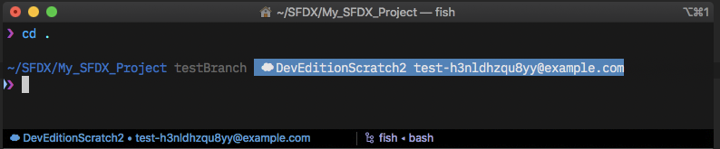
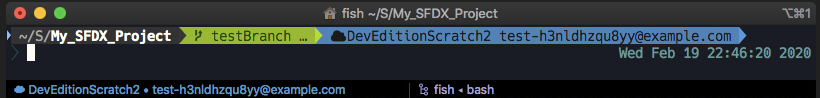

# Salesforce DX (SFDX) Status for fish
Adds the status of Salesforce DX projects to your fish prompt. Compatible with other prompts, e.g. Pure.

## Requirements

- [fish](https://github.com/fish-shell/fish-shell)

## Installation

- Copy `_prompt_sfdx.fish` to `~/.config/fish/functions/`
- If you are using [Pure](https://github.com/rafaelrinaldi/pure) prompt: Copy `fish_prompt.fish_pure` to `~/.config/fish/functions/` and rename to `fish_prompt.fish` (replace existing file, backup before)
- If you are using [bobthefish](https://github.com/oh-my-fish/theme-bobthefish) prompt: Copy `fish_prompt.fish_bobthefish` to `~/.config/fish/functions/` and rename to `fish_prompt.fish` (replace existing file, backup before)
- If you are using any other prompt or the default fish prompt: Put `echo -e -n (_prompt_sfdx)` wherever you would like to see the output in `~/.config/fish/functions/fish_prompt.fish`

**Note** You may also modify `fish_prompt.fish` instead of replacing it.

## Usage

- Simply open any directory that contains a `.force` folder and watch your prompt change

Pure prompt:

bobthefish prompt:

**Note** The iTerm2 status bar component at the bottom can be found [here](https://github.com/mschmidtkorth/iTerm-salesforce-dx).

## How to Contribute

Please see the [contribution guidelines](CONTRIBUTING.md).

## Changelog

- **0.1.0** (2020-02-19)
  - Initial release